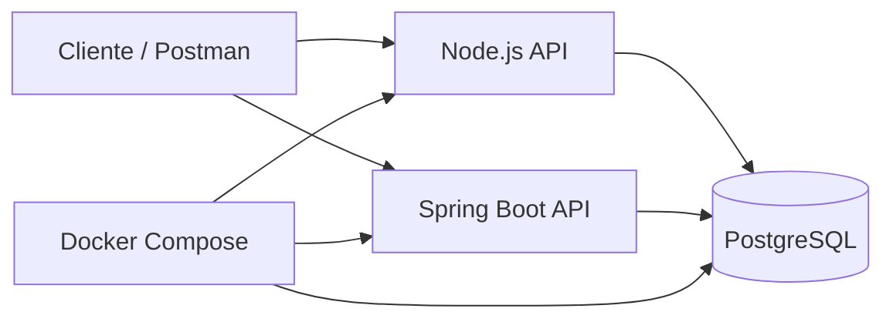

<p align="center">

</p>

<p align="center">
<a href="https://git.io/typing-svg"></a>
</p>

<p align="center">


</p>

---

## 📊 Descripción del Proyecto

**Backend Dobble** es un proyecto de portafolio que implementa dos backends funcionales sobre una misma base de datos **PostgreSQL**: uno desarrollado con **Node.js + Express + Sequelize** y otro con **Spring Boot + Spring Data JPA**. El objetivo es mostrar una arquitectura comparativa, modular y lista para pruebas locales o en contenedores.

Este repositorio está pensado para demostrar buenas prácticas de organización, separación por capas, exposición de API REST y despliegue con **Docker Compose**.

### 🎯 Características Principales

| Módulo | Funcionalidades |
|--------|-----------------|
| **👥 Personas** | CRUD completo, consulta por ID, persistencia relacional |
| **📦 Productos** | CRUD completo, administración de catálogo, precio y descripción |
| **📍 Ubicaciones** | CRUD completo, coordenadas, dirección y referencia geográfica |
| **🧾 Ventas** | Registro de ventas, consulta por persona, agregación por producto |
| **🐳 Despliegue** | Orquestación con Docker Compose y PostgreSQL compartido |
| **🧪 Pruebas** | Colección de Postman para validar endpoints rápidamente |

---

## 🛠️ Tecnologías Utilizadas

<p align="center">


</p>

---

## 🧱 Arquitectura del Proyecto



### Estructura general

- `docker-compose.yml`: orquesta la base de datos y ambos servicios.
- `node-app/`: backend en Node.js con Express, Sequelize y PostgreSQL.
- `springboot-app/`: backend en Spring Boot 3 con JPA y PostgreSQL.
- `postman_collection.json`: colección para validar endpoints.

---

## 🚀 Instalación y Configuración

### Prerrequisitos

- Docker y Docker Compose
- Node.js 18+ y npm
- Java 17 y Maven 3.9+
- PostgreSQL 15+ si deseas correr los servicios sin Docker

### Opción recomendada: Docker Compose

Desde la raíz del proyecto:

```bash
docker compose up --build
```

Servicios expuestos por defecto:

- Node.js API: `http://localhost:3000`
- Spring Boot API: `http://localhost:8080`
- PostgreSQL: `localhost:5432`

### Variables de entorno

Puedes ajustar estos valores según tu entorno:

```env
POSTGRES_USER=miuser
POSTGRES_PASSWORD=mipass
POSTGRES_DB=miapp
DB_PORT=5432
NODE_PORT=3000
SPRING_PORT=8080
```

### Opción local: Node.js

```bash
cd node-app
npm install
npm run dev
```

### Opción local: Spring Boot

```bash
cd springboot-app
mvn spring-boot:run
```

---

## 📡 Endpoints Principales

### Node.js API

Base path: `/api`

- `GET /personas`
- `GET /personas/:id`
- `POST /personas`
- `PUT /personas/:id`
- `DELETE /personas/:id`
- `GET /productos`
- `GET /productos/:id`
- `POST /productos`
- `PUT /productos/:id`
- `DELETE /productos/:id`
- `GET /ubicaciones`
- `GET /ubicaciones/:id`
- `POST /ubicaciones`
- `PUT /ubicaciones/:id`
- `DELETE /ubicaciones/:id`
- `POST /ventas`
- `GET /ventas/por-persona/:personaId`
- `GET /ventas/por-producto`

### Spring Boot API

Base path: `/api`

- `GET /personas`
- `GET /personas/{id}`
- `POST /personas`
- `PUT /personas/{id}`
- `DELETE /personas/{id}`
- `GET /productos`
- `GET /productos/{id}`
- `POST /productos`
- `PUT /productos/{id}`
- `DELETE /productos/{id}`
- `GET /ubicaciones`
- `GET /ubicaciones/{id}`
- `POST /ubicaciones`
- `PUT /ubicaciones/{id}`
- `DELETE /ubicaciones/{id}`
- `POST /ventas`
- `GET /ventas/por-persona/{personaId}`
- `GET /ventas/por-producto`

---

## 🎮 Uso del Sistema

### Ejemplo de creación de una persona

```json
{
  "nombre": "Juan Pérez",
  "email": "juan@example.com",
  "telefono": "3001234567"
}
```

### Ejemplo de creación de un producto

```json
{
  "nombre": "Café premium",
  "descripcion": "Empaque de 500 g",
  "precio": 25000
}
```

### Ejemplo de creación de una ubicación

```json
{
  "nombre": "Bodega Norte",
  "latitud": 4.7110,
  "longitud": -74.0721,
  "direccion": "Calle 80 # 12-34"
}
```

### Ejemplo de registro de una venta

```json
{
  "personaId": 1,
  "productoId": 2,
  "ubicacionId": 3,
  "cantidad": 4
}
```

---

## 🧪 Pruebas (Testing)

La colección de pruebas se encuentra en [`postman_collection.json`](postman_collection.json).

### Casos principales

- CRUD de personas
- CRUD de productos
- CRUD de ubicaciones
- Registro de ventas
- Consulta de ventas por persona
- Consulta agregada de ventas por producto

---

## 🐛 Solución de Problemas

### Problemas comunes

#### 1. Puerto ocupado

Si `3000`, `8080` o `5432` ya están en uso, cambia los valores en tu archivo `.env` o ejecuta los servicios en otros puertos.

#### 2. Error de conexión a PostgreSQL

Verifica que el contenedor de base de datos esté levantado y que las variables `POSTGRES_USER`, `POSTGRES_PASSWORD` y `POSTGRES_DB` coincidan en todos los servicios.

#### 3. Spring Boot no crea tablas

El proyecto usa `spring.jpa.hibernate.ddl-auto=update`, por lo que la conexión debe estar activa antes de iniciar la aplicación.

#### 4. Node.js no inicia

Confirma que Sequelize pueda autenticarse contra la base de datos y que el contenedor `db` esté disponible.

---

## 🤝 Contribución

Las contribuciones son bienvenidas. Flujo sugerido:

1. Haz un fork del repositorio.
2. Crea una rama para tu cambio.
3. Realiza commits claros y puntuales.
4. Abre un Pull Request con una descripción breve del aporte.

### Recomendaciones de estilo

- Mantén la estructura de capas existente.
- Conserva la convención de nombres del proyecto.
- Valida los endpoints con Postman antes de enviar cambios.

---

## 📋 Roadmap

- [x] API REST en Node.js con Express.
- [x] API REST en Spring Boot con JPA.
- [x] Persistencia compartida en PostgreSQL.
- [x] Despliegue con Docker Compose.
- [x] Colección de Postman para pruebas.
- [ ] Documentación de ejemplos por endpoint.
- [ ] Integración de pruebas automatizadas.
- [ ] Versionado formal de la API.
- [ ] Publicación de diagramas de arquitectura.

---

## 📄 Licencia

Este proyecto está bajo la Licencia MIT. Consulta el archivo `LICENSE` si está disponible en el repositorio.

---

## 👨‍💻 Autoría

Proyecto de portafolio desarrollado por **S0ntyrr**.

Si deseas, puedes actualizar esta sección con tu nombre completo, enlaces de GitHub o portafolio personal.

---

## 📞 Soporte

Si encuentras un problema o quieres proponer mejoras:

1. Abre un issue en el repositorio.
2. Revisa la colección de Postman para validar comportamiento.
3. Ajusta las variables de entorno y vuelve a ejecutar los servicios.

<p align="center">

</p>

<p align="center">
⭐ Si este proyecto te sirve como referencia de portafolio, dale una estrella ⭐
</p>
